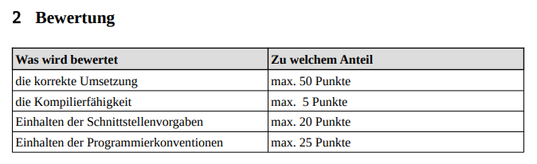
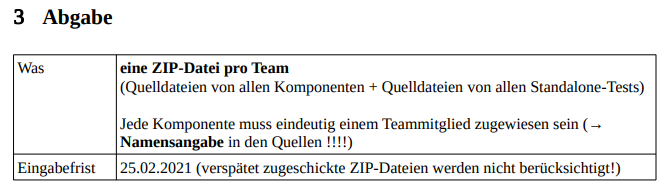

# Taschenrechner | Compilerbau Farid Derradji | DHBW 4. Semester

## Abgabe: 25.02.2021 

## Aufgabenverteilung:
* Scanner: Jan
* Parser: Niklas
* Evaluierer: Tobias
* Codegenerator: Luca

### Konventionen:
* JUnit 5

### Spezifikation:
* https://moodle.mosbach.dhbw.de/pluginfile.php/493503/mod_assign/introattachment/0/Projektaufgabe%20Taschenrechner.pdf?forcedownload=1

#### 1. Aufgabenbeschreibung:

#### 2. Bewertung:

#### 3. Abgabeinformationen:

